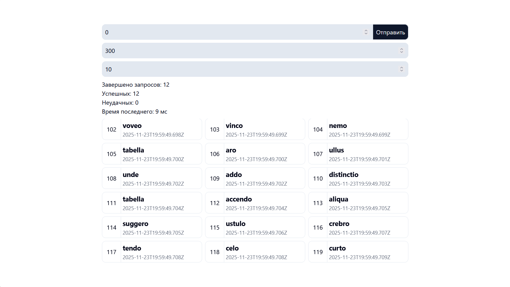

# Automativ

This is a full-stack application built with Vue.js for the frontend and NestJS for the backend, using PostgreSQL as the database.



## Technology Stack

- **Frontend**: Vue.js 3, TypeScript, Vite, TailwindCSS
- **Backend**: NestJS, TypeScript, TypeORM
- **Database**: PostgreSQL
- **Deployment**: Docker, Docker Compose

## Prerequisites

- Docker and Docker Compose
- Node.js (v18 or later)
- npm or yarn

For native development:
- PostgreSQL database running locally

## Running with Docker

1. Clone the repository
2. Copy `.env` file from root or create your own

```bash
docker-compose up --build
```

This will start:
- PostgreSQL database on port 5432
- Backend API on port 3000
- Frontend application on port 5173
- pgAdmin on port 5050

Access the application at `http://localhost:5173`

## Running Natively (Development)

### Setup Database

Make sure you have PostgreSQL running locally or adjust the connection settings in `backend/.env`.

Default settings:
- Host: localhost
- Port: 5432
- Database: myapp
- User: postgres
- Password: postgres

Example .env:

```bash
PORT=3000
VERSION=v1
POSTGRES_HOST=postgres
POSTGRES_USER=postgres
POSTGRES_PASSWORD=postgres
POSTGRES_DB=myapp
POSTGRES_PORT=5432
PGADMIN_EMAIL=admin@admin.admin
PGADMIN_PASSWORD=admin
PGADMIN_PORT=5050
VITE_SERVER_URL=http://localhost:3000/api/v1/
```

### Backend

```bash
cd backend
npm install
npm run start:dev
```

The backend will run on `http://localhost:3000`

### Frontend

```bash
cd frontend
npm install
npm run dev
```

The frontend will run on `http://localhost:5173`
